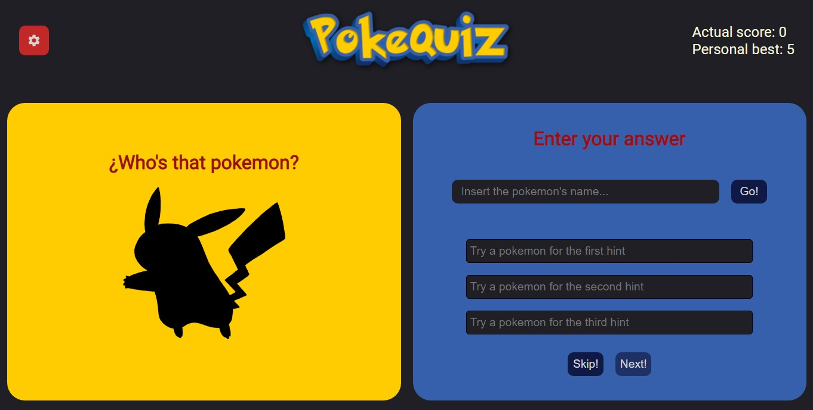

# Pokemon Guessing Game

This is a React-based game project where you have to guess the name of a Pokémon from its silhouette. The project comes with custom settings where you can choose the regions you want to play with and it saves your best score in localstorage.

## How to play

To start playing, simply look at the Pokémon's silhouette on the left side of the screen and type its name in the text field that appears to the right of the silhouette. If you type the correct name, you will score a point and move on to the next Pokémon. If you type the wrong name, the score counter will be reset and you will have to try again.

If you fail to type the Pokémon's name, a clue will be revealed to help you guess. You have up to three clues for each Pokémon, and if you still can't guess the name after the third clue, the score counter will be reset and you will move on to the next Pokémon.

## Custom settings

On the custom settings screen, you can choose which Pokémon regions you want to play with. You can select one or more regions to play with, and the game will adjust to show only the Pokémon from those regions. You can also choose the difficulty level, which adjusts the number of answer options shown for each Pokémon.

## Score and high score

Your score is shown in the top right of the screen while you play. If you get a high score, it will be saved in the browser's localstorage so you can try to beat your high score in the future.

## Installation

To install and run this project on your local machine, follow these steps:

1. Clone the repository on your local machine
2. Open a terminal and navigate to the project directory
3. Run npm install to install the dependencies
4. Run npm start to start the server
5. Open a web browser and navigate to http://localhost:3000 to see the game in action.

## Technologies Used

This project uses the following technologies:

- React
- HTML
- CSS
- JavaScript

## Credits

This project was created by [your name here]. Feel free to clone and modify the project for your own purposes. If you make any significant improvements or changes, please contribute back to the project so that others can benefit from your improvements as well.

## Screenshot

  

## Test Project

> https://lucasbutto.github.io/PokeQuiz/
